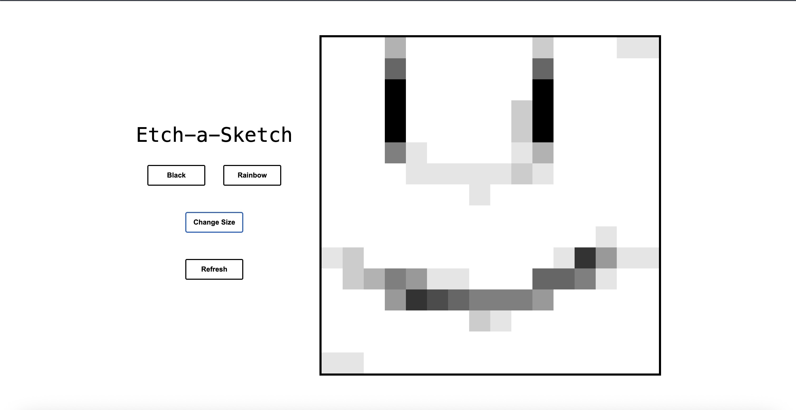

# Etch-a-Sketch

A simple and fun Etch-a-Sketch-style drawing application built with vanilla JavaScript, HTML, and CSS. Users can draw by hovering over grid squares, adjust grid size, refresh the grid, and enjoy random colors with increasing opacity for each square!

## 🔧 Features

- 🖱️ **Hover to Draw**: Color grid squares by hovering your mouse.
- 🎲 **Random Colors**: Each square gets a unique random color on first hover.
- 🌗 **Opacity Increases**: Repeated hovers increase a square's opacity up to fully visible.
- 🔢 **Adjustable Grid Size**: Choose a grid size between 2×2 and 100×100.
- 🔁 **Refresh Button**: Resets the current grid while preserving its size.

## 🚀 How to Run

1. Clone this repository:
   ```bash
   git clone https://github.com/daanniill/etch-a-sketch.git
   cd etch-a-sketch
2. Open index.html in your browser:

    open index.html      # macOS
    start index.html     # Windows
    Or just drag and drop index.html into any web browser.

📁 Project Structure

    etch-a-sketch/
    ├── index.html
    ├── styles.css
    └── script.js
🧠 How It Works
- A dynamic grid is generated based on user input.

- Each square (div.box) is styled with a random RGB color and a data-opacity attribute.

- On each hover, opacity increases by 0.1 until it reaches 1.0.

- Event listeners handle mouse interactions, resizing, and refreshing.

📸 Preview



✅ Future Improvements
🎨 Color picker mode

✍️ Click-to-draw mode

💾 Save your drawing as an image

🌓 Dark mode toggle

🧑‍💻 Built With
- HTML5

-CSS3

-JavaScript (Vanilla)

📄 **License

This project is open source and available under the MIT License.